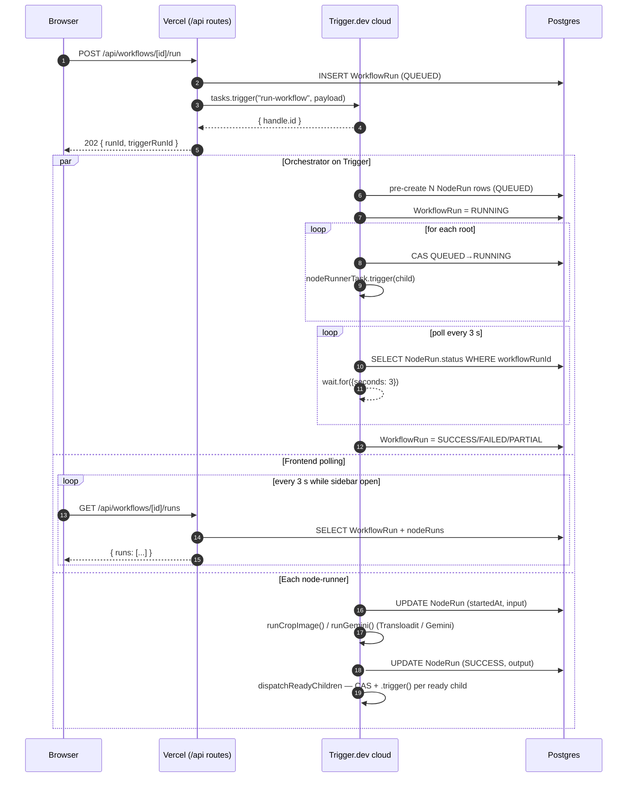
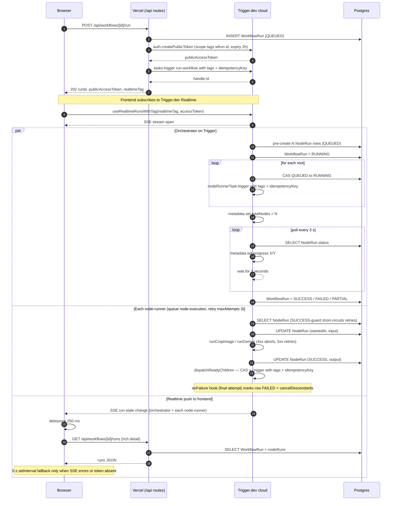

# NextFlow

A pixel-perfect clone of [Galaxy.ai](https://galaxy.ai)'s workflow builder, focused on LLM workflows powered by Google Gemini and orchestrated through Trigger.dev.

> 🌐 **Live**: [next-flow.vishalkumarroy.xyz](https://next-flow.vishalkumarroy.xyz/)

Drag nodes onto a React Flow canvas, wire them together, click Run, and watch a real DAG execute on Trigger.dev workers — Gemini calls, Transloadit-backed image cropping, type-safe edges, history sidebar, the whole thing.

---

## What's in the box

- **Visual canvas** — React Flow + Zustand, nodes drag, edges have type-checked handles, sticky notes, undo/redo, multi-select, autosave, keyboard shortcuts, minimap with per-type colours.
- **Six executable node types** — Request-Inputs (multi-field), single-field Input, Crop Image, Gemini (3.1 Pro / 3 Flash / 3.1 Flash Lite / 2.5 Pro / 2.5 Flash), Response (per-edge labelled cards), Sticky Note.
- **Recursive-dispatch DAG executor** — each finished node directly triggers any child whose other parents are already done, via fire-and-forget `nodeRunnerTask.trigger(...)` + Postgres-level CAS. Downstream nodes start the moment their direct parents resolve, independent of unrelated siblings.
- **Trigger.dev v4 production hardening** — every dispatched node carries `tags` (`workflow:`, `wfrun:`, `node:`) for dashboard filtering, an `idempotencyKey` (`wfrun-<id>-node-<nodeId>`) as defense atop the CAS, exponential-backoff retries (`maxAttempts: 3`) with `AbortTaskRunError` for permanent provider errors, a shared `node-execution` queue with env-driven `concurrencyLimit`, and an `onFailure` lifecycle hook that fails-fast + cascades cancellations when a worker crashes outside its own try/catch.
- **Live history sidebar via Trigger.dev Realtime** — frontend subscribes to `wfrun:<id>` via `useRealtimeRunsWithTag` with a server-minted `publicAccessToken`. Updates push over SSE; the sidebar refetches our `/runs` endpoint (debounced) for the rich detail (timestamps, input/output JSON, errors). 5 s polling fallback when the SSE stream errors or the token mint failed.
- **Type-safe connections** — text/number/boolean/image/audio/video/file handles, colour-coded across the canvas (orange = text, pink = number, cyan = image, indigo = video, violet = audio, zinc = file, green/orange for response/result). Edges preview their type colour while dragging.
- **First-class file uploads** — anything dropped on a node hits Transloadit immediately. Workflow JSON in Postgres only stores compact CDN URLs, never base64 blobs.
- **Image cropping** — Crop nodes call Transloadit's `/image/resize` robot with a percentage geometry box. Live cutout overlay on the input image preview reflects the slider values in real time.
- **Per-node + full-flow Run** — kick off a single node or the whole DAG. Run buttons cross-disable while any run is in flight so you can't queue competing runs. Optimistic local state means the spinner shows the moment you click, not after Trigger.dev's worker picks up the task.

---

## Tech stack

| Layer | Tool |
| --- | --- |
| Framework | Next.js 16 (App Router, RSC, Turbopack) |
| Language | TypeScript (strict) |
| Database | Prisma Postgres (via Vercel Marketplace) |
| ORM | Prisma 6 |
| Auth | Clerk (production instance with custom domain) |
| Canvas | React Flow 11 + Zustand 5 |
| Workers | Trigger.dev v4 (cloud) — `tasks`, `auth`, `logger`, `metadata`, `wait`, `AbortTaskRunError` |
| Live UI updates | `@trigger.dev/react-hooks` (`useRealtimeRunsWithTag`) over SSE |
| File CDN + image ops | Transloadit |
| LLM | Google AI Studio (`@google/generative-ai`) |
| Styling | Tailwind CSS v4 |
| Validation | Zod |
| Icons | Lucide |

---

## Architecture

Three deployments cooperate:

```
┌──────────────────────┐    POST /api/workflows/[id]/run    ┌───────────────────────────┐
│   Browser (Next.js)  │ ─────────────────────────────────► │  Vercel function (Node)   │
│  HistorySidebar:     │                                    │  /run, /runs, /token,     │
│  useRealtimeRunsWith │  ◄─── 202 { token, tag, runId }    │  /uploads                 │
│  Tag(tag, token)     │                                    └────┬──────────────────────┘
└─────────┬────────────┘                                         │ tasks.trigger("run-workflow",
          │                                                      │   payload, { tags, idempotencyKey })
          │ SSE push (Realtime)                                  │ auth.createPublicToken({ tags })
          │ ◄────────────────────────────────────────────┐       ▼
          │                                              │ ┌──────────────────────────┐
          │  GET /api/workflows/[id]/runs (rich detail)  │ │  Trigger.dev cloud       │
          ▼                                              │ │  ┌─────────────────────┐ │
   debounced refetch                                     │ │  │ run-workflow        │ │
          │                                              │ │  │  orchestrator: pre- │ │
          ▼                                              │ │  │  create rows, fire  │ │
   ┌──────────────────┐                                  │ │  │  roots, poll /3 s,  │ │
   │ Prisma Postgres  │ ◄─ NodeRun reads/writes ─────────┘ │  │  finalise           │ │
   │ Workflow,        │                                    │  └────────┬────────────┘ │
   │ WorkflowRun,     │ ◄─ NodeRun pre-create ─────────────┤           │ .trigger()   │
   │ NodeRun          │                                    │           ▼              │
   └──────────────────┘                                    │  ┌─────────────────────┐ │
                                                           │  │ node-runner         │ │
   ┌──────────────────┐                                    │  │  CAS-claim row      │ │
   │ Transloadit CDN  │ ◄─ runCropImage() / runGemini() ───┤  │  → run worker       │ │
   │ + image robots   │    + Google AI                     │  │  → dispatch ready   │ │
   └──────────────────┘                                    │  │     children        │ │
                                                           │  │  onFailure: cascade │ │
                                                           │  │     cancel          │ │
                                                           │  └─────────────────────┘ │
                                                           └──────────────────────────┘
```

`run-workflow` is the **orchestrator**: it pre-creates a `NodeRun` row per executable node in `QUEUED`, fire-and-forget triggers root nodes (no parents), then polls `WorkflowRun.nodeRuns` every 3 s with `wait.for` until everything is terminal and writes the final `WorkflowRun.status`.

`node-runner` is the **universal dispatcher**: one Trigger.dev task that switches on `node.type` and runs the matching worker (`runCropImage` / `runGemini` / `runRequestInputs` / `runInput` / `runResponse`). After success it CAS-checks each child's parents — if all are SUCCESS, it atomic-claims the child row (`updateMany WHERE status=QUEUED`) and fires another `nodeRunnerTask.trigger(...)`. On final-attempt failure the `onFailure` hook fails the row + cascades CANCELLED to descendants so the orchestrator can finalise without waiting on dead RUNNING rows.

Long-form deep dive: [`docs/dag-concurrency.md`](./docs/dag-concurrency.md). Production deploy runbook: [`DEPLOYMENT.md`](./DEPLOYMENT.md).

### Sequence flow — before and after the Trigger best-practice round

The recursive-dispatch executor was already in place; this round adopted Trigger.dev's native primitives (`tags`, `idempotencyKey`, `useRealtimeRunsWithTag`, `auth.createPublicToken`, `onFailure`, `queue`, `retry` with `AbortTaskRunError`, `metadata`, `logger`) without changing the architecture. The visible delta is **how the frontend learns about progress** and **how reliably the system handles transient failures**.

**Before — frontend polled `/runs` every 3 s:**



**After — Realtime SSE push + idempotency keys + retries + `onFailure` hook:**



Key visible differences in the "after" flow:

- **Realtime token mint** is one extra Trigger API call before `tasks.trigger` — minted server-side using `TRIGGER_SECRET_KEY`, returned to the browser scoped only to `wfrun:<runId>` for 2 h.
- **Frontend's `setInterval(fetchRuns, 3000)` is gone** for active runs — `useRealtimeRunsWithTag` opens an SSE connection and pushes updates as Trigger sees them. The browser still hits `/runs` for the rich detail (timestamps, input/output JSON), but only after a Realtime tick (debounced 250 ms), not on a fixed timer.
- **Idempotency keys** mean a retried HTTP call (API route) or a retried Trigger attempt (dispatcher) won't double-launch.
- **Retries with `AbortTaskRunError`** mean transient Transloadit / Gemini hiccups recover automatically (3 attempts, exponential 1 s → 30 s with jitter); permanent 4xx errors short-circuit the policy.
- **`onFailure` hook + cascade-cancel** means a worker crashing in a way its own try/catch can't see (OOM, host failure, `maxDuration` timeout) still leaves the row `FAILED` + descendants `CANCELLED` — orchestrator finalises within ~5 s instead of waiting 600 s on phantom RUNNING rows.
- **Queue concurrency** caps simultaneous external-API calls regardless of fan-out width.
- **Tags + structured `logger` + light `metadata`** make Trigger dashboard triage actually pleasant — filter by `wfrun:<id>` to see every run for a workflow, and the orchestrator's `progress: 12/30` shows up on its detail page.

---

## Getting started locally

### Prerequisites

- Node 20+ (Vercel deploys on 22; both work locally).
- A Postgres URL — either a Prisma Postgres database (free tier via the Vercel Marketplace integration is plenty for dev) or a local Postgres instance. The schema expects two URLs (pooled + direct); a local Postgres can use the same string for both.
- Clerk dev instance (publishable + secret keys).
- Trigger.dev account + project ref.
- Google AI Studio API key.
- Transloadit auth key + secret.

### Install

```bash
git clone https://github.com/<your-fork>/NextFlow.git
cd NextFlow
npm install                       # postinstall runs `prisma generate`
```

### Configure env

Copy `.env.example` to `.env.local` and fill in:

```ini
# ─── Database (Prisma Postgres via Vercel, or local) ──────────────────────
PRISMA_DATABASE_URL=prisma+postgres://…              # pooled / runtime (Accelerate)
POSTGRES_URL=postgresql://…                          # direct / migrations

# ─── Clerk auth ────────────────────────────────────────────────────────────
NEXT_PUBLIC_CLERK_PUBLISHABLE_KEY=pk_test_…
CLERK_SECRET_KEY=sk_test_…
NEXT_PUBLIC_CLERK_SIGN_IN_URL=/sign-in
NEXT_PUBLIC_CLERK_SIGN_UP_URL=/sign-up
NEXT_PUBLIC_CLERK_AFTER_SIGN_IN_URL=/dashboard
NEXT_PUBLIC_CLERK_AFTER_SIGN_UP_URL=/dashboard

# ─── Trigger.dev ───────────────────────────────────────────────────────────
TRIGGER_SECRET_KEY=tr_dev_…
TRIGGER_PROJECT_REF=proj_…

# ─── LLM + file storage ────────────────────────────────────────────────────
GOOGLE_GENERATIVE_AI_API_KEY=AIza…
TRANSLOADIT_AUTH_KEY=…
TRANSLOADIT_AUTH_SECRET=…

# ─── Cosmetic ──────────────────────────────────────────────────────────────
CANDIDATE_LINKEDIN_URL=https://www.linkedin.com/in/your-profile/
```

### Migrate

```bash
npx prisma migrate deploy
```

### Run

You need three processes for a complete dev loop:

```bash
# 1. Next.js
npm run dev                       # http://localhost:3000

# 2. Trigger.dev local worker (in another terminal)
npm run trigger:dev

# 3. (Optional) Prisma Studio for poking at workflow rows
npm run db:studio
```

Sign in via Clerk, hit **New Workflow**, drag a Crop and a Gemini in from the bottom-center picker, click **Run flow**, watch the History sidebar live-update.

---

## Project structure

```
src/
├─ app/
│  ├─ (app)/                  authenticated routes (dashboard, /workflows/[id])
│  ├─ (auth)/                 sign-in / sign-up Clerk flows
│  ├─ api/
│  │  ├─ workflows/
│  │  │  ├─ [id]/run/         POST: create WorkflowRun, mint publicAccessToken,
│  │  │  │                    tasks.trigger("run-workflow", payload, { tags,
│  │  │  │                    idempotencyKey })
│  │  │  ├─ [id]/runs/        GET: rich-detail fetch (timestamps, input/output);
│  │  │  │                    debounced refetch from sidebar on Realtime tick
│  │  │  └─ [id]/runs/[runId]/token/   GET: refresh publicAccessToken for long-running runs
│  │  ├─ runs/[runId]/        GET: per-run polling (used by canvas during active run)
│  │  └─ uploads/             POST: stream buffers → Transloadit /upload/handle
│  └─ layout.tsx              root layout, ClerkProvider, LinkedinAttribution
├─ components/
│  ├─ canvas/
│  │  ├─ WorkflowCanvas.tsx   ReactFlow wrapper; captures publicAccessToken +
│  │  │                       realtimeTag from /run response
│  │  ├─ HistorySidebar.tsx   useRealtimeRunsWithTag + debounced refetch + 5 s fallback
│  │  ├─ RunContext.tsx       WorkflowRunProvider (triggerRun, isRunning)
│  │  └─ NodePicker.tsx       …
│  ├─ nodes/                  RequestInputs, Crop, Gemini, Response, Input, StickyNote
│  └─ CopyButton.tsx          shared copy-to-clipboard button
├─ lib/
│  ├─ handleColors.ts         single source of truth for handle/edge colours
│  ├─ handles.ts              type-safe connection validation
│  ├─ uploadFile.ts           client → /api/uploads helper
│  ├─ transloadit.ts          server-side Transloadit SDK wrappers
│  ├─ gemini.ts               server-side Gemini SDK wrapper (with model alias map)
│  ├─ triggerErrors.ts        isPermanentError / rethrowClassified
│  │                          (AbortTaskRunError gating)
│  ├─ connectedValues.ts      orchestrator-style resolvers reused on the canvas
│  └─ prisma.ts               singleton Prisma client
├─ store/
│  └─ useWorkflowStore.ts     Zustand store: nodes, edges, history, run status
├─ trigger/
│  ├─ runWorkflow.ts          orchestrator: setup + poll + finalise.
│  │                          Roots fired with buildChildTriggerOptions()
│  │                          (tags + idempotencyKey). metadata.set + logger.info.
│  ├─ nodeRunner.ts           universal dispatcher. retry: { maxAttempts: 3,
│  │                          factor: 2, randomize: true }. queue: { name:
│  │                          "node-execution", concurrencyLimit: env-driven }.
│  │                          onFailure hook. buildChildTriggerOptions().
│  ├─ dagDispatch.ts          loadGraph, tryClaimNodeRun (CAS),
│  │                          dispatchReadyChildren, cancelDescendants,
│  │                          buildParentByEdge, ChildTriggerOptions
│  ├─ inlineNodes.ts          runRequestInputs / runInput / runResponse +
│  │                          buildResponseInputs (fast no-network workers)
│  ├─ cropImage.ts            runCropImage: SUCCESS-guard, 30 s artificial
│  │                          delay, rethrowClassified
│  └─ gemini.ts               runGemini: SUCCESS-guard, rethrowClassified
└─ middleware.ts              Clerk auth gate

prisma/
└─ schema.prisma              Workflow, WorkflowRun, NodeRun

docs/
└─ dag-concurrency.md         postmortem + design doc on the executor

DEPLOYMENT.md                 Vercel + Trigger.dev + Clerk runbook
trigger.config.ts             Trigger.dev build config (prismaExtension)
```

---

## Deploying

[`DEPLOYMENT.md`](./DEPLOYMENT.md) is the click-by-click runbook — Vercel project setup, the two URLs Prisma Postgres injects, Clerk production keys, separate `npm run trigger:deploy`, Transloadit constraints, common foot-guns. The short version:

```bash
# 1. Trigger.dev cloud (do this BEFORE Vercel — otherwise the first run 404s)
npm run trigger:deploy

# 2. Provision Prisma Postgres via Vercel Marketplace + run migrations
npx prisma migrate deploy

# 3. Push to main; Vercel auto-builds
git push origin main
```

Make sure all the env vars from `.env.local` are also set on:
- Vercel (Settings → Environment Variables → Production)
- Trigger.dev (project → Production env → Environment Variables)

The two services don't share secrets.

---

## Notable design decisions

- **Recursive dispatch instead of level-batched `triggerAndWait`** — Trigger v4 forbids multiple pending `triggerAndWait`s on one task, and `batchTriggerAndWait` is atomic at its level boundary (LLM2 had to wait for unrelated crops at the same level). The current shape: orchestrator pre-creates `NodeRun` rows in `QUEUED`, fire-and-forget triggers roots, and each `nodeRunnerTask` cascades to ready children directly via `nodeRunnerTask.trigger(...)` after CAS-claiming the row. Orchestrator polls every 3 s on its own DB only for finalisation. See [`docs/dag-concurrency.md`](./docs/dag-concurrency.md) for the iteration history (eager-IIFE → strict sequential → per-type batches → mixed-batch → recursive dispatch).
- **CAS + idempotency keys are layered, not redundant.** Postgres `updateMany WHERE status=QUEUED` gives the immediate `RUNNING` UI transition (sidebar shows "Running" the moment a parent finishes). Trigger.dev `idempotencyKey: wfrun-<id>-node-<nodeId>` dedups the actual scheduling if a future code path or retry bypasses the CAS. Both layers retained.
- **Trigger.dev Realtime replaces 3 s sidebar polling** — the `/run` route mints `auth.createPublicToken({ scopes: { read: { tags: ["wfrun:<id>"] } }, expirationTime: "2h" })` and ships it to the browser. `useRealtimeRunsWithTag` opens an SSE stream; on each push the sidebar debounces 250 ms then refetches our `/runs` endpoint for the rich detail (timestamps, input/output JSON). The `setInterval(fetchRuns, 5000)` fallback only fires when Realtime is unavailable or the SSE errors.
- **`onFailure` lifecycle hook is the safety net** for worker crashes outside the worker's own try/catch (OOM, host failure, `maxDuration` timeout). It marks the row `FAILED` + cascades CANCELLED to descendants via `cancelDescendants`. Without it, a crashed worker leaves the row in `RUNNING` until the orchestrator's 600 s watchdog fires.
- **Retries with `AbortTaskRunError`** — `nodeRunnerTask` retries 3× (factor 2, 1 s → 30 s with jitter) for transient failures. `cropImage` / `gemini` workers wrap external errors via `rethrowClassified`: validation / auth / 4xx → `AbortTaskRunError` (short-circuit retries), network / 5xx / rate-limit → rethrow as-is (full retry). SUCCESS-guard at the top of each worker reads the row first; if it's already `SUCCESS` with output present, the worker returns early — keeps retries idempotent without redoing the (paid) Transloadit + Gemini round-trip or the 30 s artificial delay.
- **Single `node-execution` queue with concurrency cap** — even a 50-node fan-out can't trip Transloadit / Gemini per-account rate limits. `concurrencyLimit` is `NODE_RUNNER_CONCURRENCY` env-var, defaulting to 5 in dev and 20 in prod.
- **Image cropping uses Transloadit's `/image/resize` (ImageMagick), not `/video/encode` (FFmpeg).** `/video/encode` is FFmpeg-backed and the natural fit for an "FFmpeg crop", but it trips `VIDEO_ENCODE_VALIDATION` on most preset combinations for image inputs. ImageMagick is the platform-native path for image crops.
- **Mandatory 30 s artificial delay on Crop** is preserved (PRD requirement). It lives inside `runCropImage`, after the Transloadit assembly resolves and before writing the row to `SUCCESS` — so the SUCCESS-guard correctly skips it on retry.
- **Every node type goes through `nodeRunnerTask` now** — `runRequestInputs` / `runInput` / `runResponse` are plain async worker functions in `inlineNodes.ts` invoked from the dispatcher just like `runCropImage` / `runGemini`. The History sidebar still shows `nodeType: "cropImage" | "gemini" | "requestInputs" | "input" | "response"` rows (named workers write the `NodeRun`); `node-runner` itself never writes to `NodeRun`, so the sidebar stays free of dispatcher noise. Trigger.dev's cloud dashboard surfaces every `node-runner` invocation for debugging.
- **Files never live as base64 in Postgres**. Every upload streams through `/api/uploads` → Transloadit → CDN URL stored on the node. Workflow JSON stays in the kilobyte range.

---

## License

MIT.
